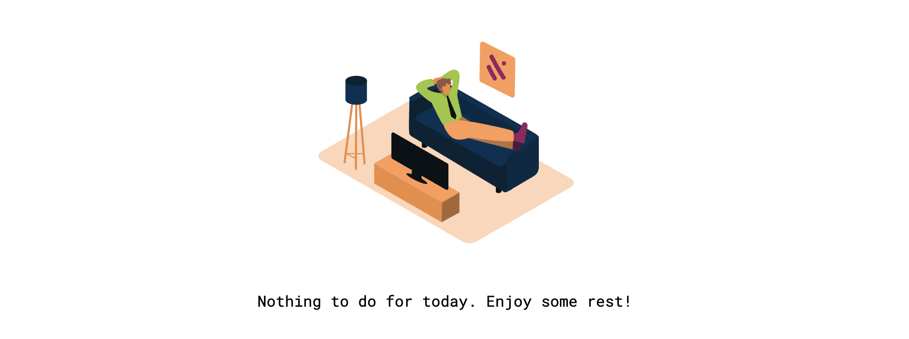

# TodoDis | Tasks and Projects

## Table of contents

1. A brief introduction
2. Features
   1. Task Management
   2. Project Management
   3. Quality of life features
3. Design choiches and philosophy
   1. On the separation of concerns
   2. Known Issues and Optimizations
4. Closing words

## 1 | A brief introduction

TodoDis has been built as an exercise. The assignment of building a Todo App was given to me while following the most excellent https://www.theodinproject.com open course to
learn Web Development and Software Enginnering. The assignment itself was quite generic and simple in its goals but the openess of the project encrourages students to be creative and explore many ideas
and differnt features.

As I am still learning myself I wanted to challenge myself to deliver a somewhat polished product utilizing all the skills that the course has provided me until now. Speaking of skills and tools, this project has
been realized entirely in vanilla Javascript, HTML and CSS. No frontend frameworks or libraries are used here. The dynamic aspects and components are built on top of <b>template</b> html elements. 
The base goals to reach in this project have been met, so that the app is actually working ad can be used as a finished product...<b>not just a commercial-level one!</b> The app performs every function on the client side
and stores data in the browser's localStorage. In the future I hope to come back and give it a proper backend or - moving on an "offline first" philosophy - adapting storage functions to work with IndexedDB and turn it into a Progressive Web App.

## 2 | Features 

### 2.1 | Task Management

The user can create, edit, delete and mark tasks as completed. On top of this basic functionality, every Task can be assigned a due Date in a Javascipt friendly format, a priority level ranging from 1 to 4 (where 1 is the highest
and 4 the lowest) and can be assigned to a Project. Tasks that do not belong to a project are stored in a "General" project whose job is to give a place to single tasks not related between each other. A completed task is not
deleted but its "done" property is updated to "true" where in the opposite it would be "false".

### 2.2 | Project Management 

The user can create, edit, delete and mark projects as completed. Every project has a color the identifies it uniquely in the UI. Projects are mainly a collection of Tasks. Every project can contain an unlimited number of tasks 
(at least as long as there is storage). Project are shown in the UI Sidebar and the user can access them by clicking on their tab. The displayed project can be edited or deleted by its page.

### 2.3 | Quality of Life Features

What can really make a ìn app stand out for the user is the amount and usefulness of Quality of Life Features. The following list will explaing each and one of them.

  

#### Dialogs

Creation and editing of Tasks and Project happen inside _ad hoc_ created dialogs. Inside the Todo dialog, the user can give a Task a title, a description, and there are different inputs for assigning a due date,
the priority and the project. If the user leaves the Title field empty, the saving buttons will stay disabled: it is not allowed to create empty tasks. If the user leaves all the other inputs empty there default values that
will be assigned to the todo: the dueDate would be today, the priority the lowest and the project would be the general one. Same attention has been given to Project creation and editing: there is no place for empty or unnamed projects!
Once the user clicks on editing options, the same dialog will show up already filled with the would-be-edited todo/project.
  
#### Alerts 

To prevent accidental deletion of todos and projects, an entirely *custom* alert pop will show up to ask the user for confirmation on the deleting operation.

#### Today Tab

The Today Tab will have and handy number on his right side telling the user how many tasks are due for Today's date. By clicking on it the user will se a page that shows only today's tasks, any interaction inside this page
is saved in every project whose todos are completed, deleted or modified.

#### Search and Filters

In the Search & Filters tab the user can search a specific or different tasks. A little selection menu allows the user to set the property they are about to look for. The user can search by title (under the hood it is very
basic Regular Expression matching), by date and finally by priority. Just like inside Today's Tab the Todos are fully interactable while in the Searched view.

#### Graphics for Feedback

If a project is empty a cute graphical feedback will show up in the project view. There are actually different graphics for variety and custom messages for Todays Tab and Search and Filters. The Images utilized are courtesy of
https://www.manypixels.co. The Svgs are not actually linked to the page but are bundled inside the app using Webpack SVG loader.

#### Foldable Sidebar

The site, at this state is unfortunately not responsive, but the user can fold the Sidebar to gain more space when working with todos.

## 3 | Design choices and philosophy

The idea behind TodoDis is that the app is not just an assignment, but a learning opportunity and a good chance to show some progress. This is why the app sports a sleak and (wannabe) simplistic professional look. Shapes are lighlty
rounded, as it is the current design fashion.

In terms of code, the app runs on the shoulder of four main components: the Storage, the Logic, the GUI and its components (Cards, Dialogs and Forms) and the two fundamental classes Todo and Project.

#### Todos and Projects

Todos and Project are both definedas ECMASCRIPT6 classes and not objects. Every Todo instance shares setters and getters with her sibilings. Every Todo is uniquely identified by an hexadecimal UID that is randomly generated
at the moment of constructor call. The purpose of the UID is to identify easily a Todo instance even if the Project it belongs to gets edited by the user. 
A Project instace is more than just a collection of tasks: it has it own description and hexadecimal UID. In this case the UID lets the app identify uniquely the project even if every other property gets edited. The UID of a project
is the key of the key-value pair of data that is stored inside localStorage. Both projects and todo instances have methods to take control of JSON serialization and de-serialization to be converted in JSON format for saving.

#### Storage

The Store component purpose is to load a project in memory, save it into the local storage, remove or patch a project identified by its UID.

#### Logic 

The Logic component is responsible for creation, deletion and editing of both Todos and Projects. Every data manipulation happens inside the browser and when it is over the Store component gets called to save or update localStorage.

#### GUI

The GUI component handles the behaviour of the user interface. Inside of the GUI module are defined all functions that regard the general GUI behaviour like project rendering on screen, todo UI elements filtering for showing search results
or today's tasks, project creation or deletion in and from the Content Area. The GUI also interacts with sub UI components like the Sidebar, Todo cards, and Todo and Project dialogs. All of those components are strongly interconnected but 
stored in separated files for keeping the code in order and readable. All of the UI-related components are written as Immediately Invoked Functions to grab instantly every needed reference to UI elements and to activate event listeners.

### 3.1 | On the separation of of concerns

The greatest challange in build a somewhat complex project lies in the fact that the UI and the app logic should stay separated and not built one on top of each other. This ensures order and scalability of the software, prevents vulnerabilities
and lets the developer to update features without breaking everything. In this project, the separation is guaranteed by the fact that the logic components (Logic and Storage) know actually nothing about the GUI. Every user
input in the GUI is just passed as a parameter of logic functions.
If the User creates for example a new Todo the graphical components will just pass an Object with Todo properties to the Logic component the will validate them and create a Todo instace to be stored inside the a project. After that the Storage
component will save the project by asking the Project to serialize itself into a JSON object. Every Todo inside the project will also serialize itself and the newcly created JSON object containing the project and the Todos will be
store in local storage under the project UID as key value.

### 3.2 | Known issues and Optimization

Lets address the elephant in th room: the site is not responsive at this moment. This may change in the near future after a deep dive into responsive web design. Changes to apply would probably be the following:

* Replace the sidebar with a bottom navbar when on small screen.
* Show the content view in the upper part of the screen and with column orientation.

There is also the fact that since the app uses localStorage not only data is persistent only inside a single browser but since localStorage works in the same way as JSON storage, the app is forced to load an entire project 
when it need to access even its name or just a single todo. Same thing applies to saving and editing data. Once a real backend is wired to the app this problem would be easily solved.

### 4 | Closing words

Even though the project is largely finished It has been a fun little adventure and it would be a shame leaving here wihout updating it, so since it is open source everybody can modify it and if anyone wants to collaborate, as a solo dev I would be immensely happy!
I will go back to this myself once I grasped more advanced concepts of Web Development but until then every feedback and suggestion is much much appreciated.
